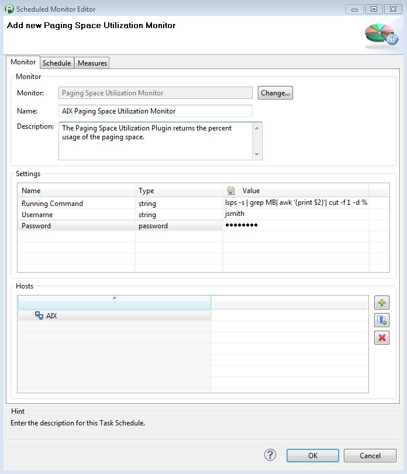
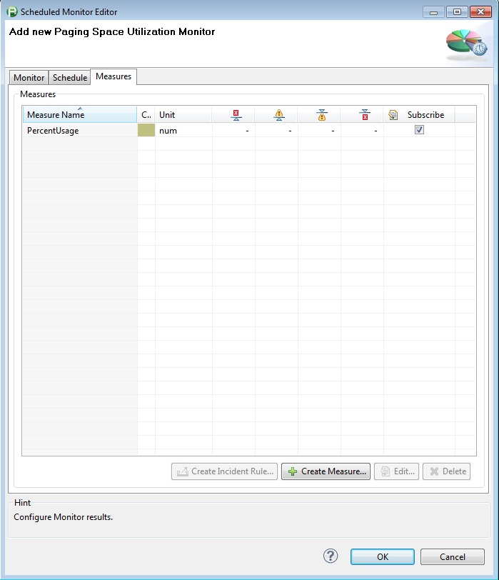

# Paging Space Utilization Monitor Plugin

## Overview

The monitor returns the percent usage of the paging space via the command below on AIX servers. The command is specific to AIX. The user credentials entered when configuring the monitor must have ssh
access to the remote server you wish to monitor.

This monitor is hard coded to run

    
    
    "lsps -s | grep MB| awk '{print $2}'| cut -f 1 -d %"

## Plugin Details

| Name | Paging Space Utilization Monitor Plugin
| :--- | :---
| Author  | Derek Abing
| Supported dynaTrace Versions | >= 5.5
| License | [dynaTrace BSD](dynaTraceBSD.txt)
| Support | [Not Supported ](https://community.compuwareapm.com/community/display/DL/Support+Levels#SupportLevels-Community)  
| Release History | 2013-03-12 Initial Release
| Download | [Paging Space Utilization Monitor Plugin 1.0.1](com.dynatrace.diagnostics.plugins.PagingSpaceUtilizationPlugin_1.0.1.jar) 

## Provided Measures

**PercentUsage**: Returns count of running processes 

## Configuration

| Name | Value
| :--- | :---
| Running Command |This monitor is hard coded to run "lsps -s | grep MB| awk '{print $2}'| cut -f 1 -d %"
| Username |The username that is used for authorization with the host
| Password | The password for the username

## Installation

Import the Plugin into the dynaTrace Server. For details how to do this please refer to the [dynaTrace
documentation](https://community.compuwareapm.com/community.dynatrace.com/community/display/DOCDT50/Manage+and+Develop+Plugins#ManageandDevelopPlugins-ManageandDevelopPlugins).

